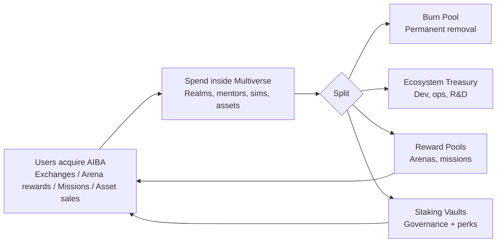
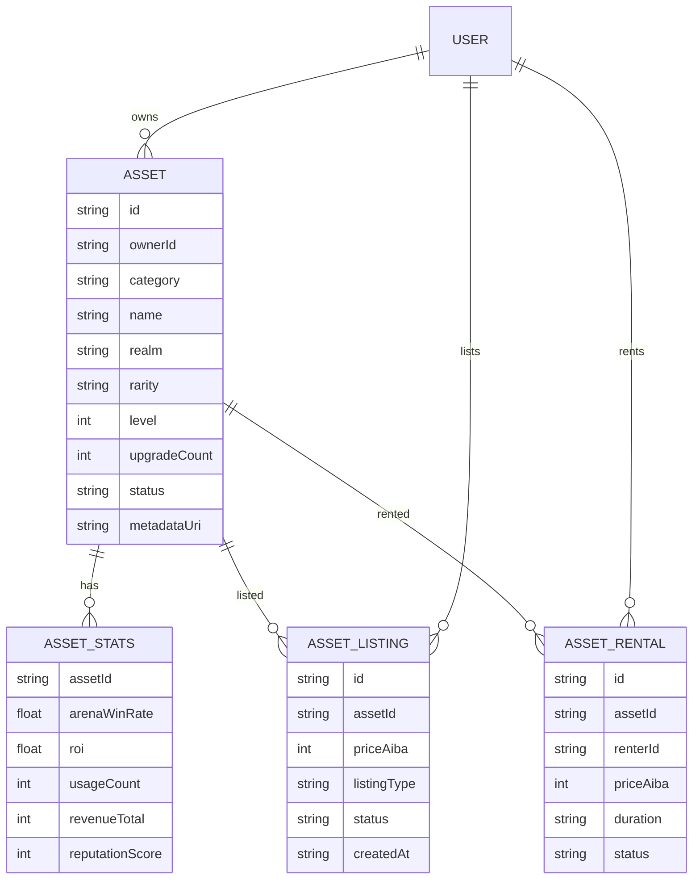

# AI Learning Multiverse — Economic Engine (Deep Systems)

**Version:** Feb 2025  
**Scope:** Token flow, AI asset marketplace, earning paths, balancing model, and governance/mentor/league alignment.

This is the **implementation‑ready economic architecture** for the AIBA Arena University → AI Learning Multiverse.

---

## 1) Exact AIBA Token Flow (Ecosystem Circulation)

### 1.1 Primary flow (macro)

**Principle:** Learning = production = wealth. Tokens are **spent**, **burned**, **staked**, and **re‑rewarded** in a closed loop.

### 1.2 Secondary flows (micro loops)

**AI Asset Economy Loop**  
Mint asset → pay mint fee (burn + treasury) → list asset → buyer pays AIBA → marketplace fee → seller income → upgrades → more minting.

**Arena Competition Loop**  
Enter arena → entry fee split (burn + treasury + prize pool) → winners paid → assets gain reputation → higher demand and revenue.

---

## 2) AI Asset Marketplace Structure (Data + UX)

### 2.1 Asset types

| Category | Example | Function |
|---------|---------|----------|
| **AI Agents** | Trading/strategy bots | Compete or automate |
| **AI Brains** | Decision models | Plug into systems |
| **AI Creators** | Art/video/music engines | Content generation |
| **AI Workflows** | Automation pipelines | Business tools |
| **AI Systems** | Governance frameworks | DAO / digital nations |

### 2.2 Market segments

1. **Primary Mint Zone** — new assets minted (mint fee: burn + treasury).  
2. **Secondary Trade Zone** — buy/sell existing assets (small platform fee).  
3. **Rental Market** — owners rent AI agents; renters pay usage fees.  
4. **Fractional Ownership** — high‑value assets split into shares (revenue distributed).

### 2.3 Core data model (MVP)

**Listing types:** `primary_mint`, `secondary_sale`, `rental`, `fractional_share`.  
**Core metrics:** win‑rate, ROI, revenue, reputation.

### 2.4 UX flow (miniapp)

1. **Mint** → Choose realm + asset type → pay AIBA → asset created  
2. **List** → set price/terms → visible in marketplace  
3. **Buy/Rent** → pay AIBA → ownership or rental period  
4. **Use in arenas** → performance updates value + reputation

---

## 3) Earning Paths — Beginner → Elite

### 3.1 Beginner (L1–L2)

**Goal:** Learn + micro‑earn  
Earning methods:
- Learning missions (capsules + mini sims)
- Beginner arena rewards
- Small AI workflows (low‑tier assets)
- Rentals of low‑level agents

**Outcome:** First asset + first recurring income.

### 3.2 Intermediate (L3–L5)

**Goal:** Build + compete  
Earning methods:
- Specialized AI agents
- Mid‑tier arena wins
- Renting automation tools
- Selling workflow modules
- Assistant AI mentor roles

**Outcome:** AI entrepreneur with compounding assets.

### 3.3 Elite (L6–L8)

**Goal:** Own + govern  
Earning methods:
- High‑performance assets in elite arenas
- AI service empires within AIBA
- Governance rewards (staking + votes)
- Licensing advanced AI systems
- Sponsored arena wins

**Outcome:** AI tycoon with ecosystem influence.

---

## 4) Economic Balancing Model (Long‑Term Stability)

### 4.1 Supply control (burn + lock)

| Mechanism | Effect |
|-----------|--------|
| **Mint/upgrade burn** | Reduces circulating supply as activity grows |
| **Elite arena entry burn** | High‑level play reduces supply |
| **Mentor tier staking** | Locks supply for access |

### 4.2 Reward alignment (anti‑inflation)

Rewards are **performance‑based**:
- Arena outcomes (win‑rate, skill rank)
- Mission difficulty
- Asset contributions (usage, revenue)

This prevents passive farming.

### 4.3 Treasury stabilization

Treasury acts like a central bank:
- Funds dev + ops
- Buys back tokens during downturns
- Sponsors competitions + research realms

### 4.4 Difficulty scaling

As user count rises:
- Arena difficulty increases
- Asset quality requirements rise
- Low‑value asset oversupply is prevented

---

## 5) Governance Power Structure

**Layer 1:** Super Admin (protocol upgrades, security overrides, treasury oversight)  
**Layer 2:** AIBA Council (top stakers + elite builders; approve realms + economy changes)  
**Layer 3:** Citizen DAO (all token holders; stake + reputation weighted voting)

---

## 6) Mentor Progression System

Mentor tiers:
AI Guide → AI Coach → AI Strategist → AI Architect → AI Mastermind

Mentors evolve by:
- User progress
- Arena performance
- Asset creation success

Mentors can become **AI assets** (rentable, upgradable, stake‑gated).

---

## 7) Arena League Hierarchy

Bronze → Silver → Gold → Platinum → Diamond → Master → Grandmaster → **AIBA Legends**

Higher leagues:
- Larger prize pools
- Higher token burns on entry
- Greater asset value impact

---

## 8) Implementation Roadmap (economic systems)

**Phase 1 (MVP):**  
- Token flow splits (burn / treasury / rewards / staking)  
- Marketplace primary + secondary sales  
- Beginner arenas + reward logic

**Phase 2 (Growth):**  
- Rentals + fractional ownership  
- Asset reputation + ROI metrics  
- Mentor tiering + staking access

**Phase 3 (Civilization):**  
- Inter‑realm masteries  
- Governance council + DAO proposals  
- Sponsored arenas + external licensing

---

## 9) Deliverables (next build items)

- Token flow diagram (already defined above)  
- Asset marketplace API + data model  
- Earning path UX (beginner/intermediate/elite)  
- Balancing params (burn %, staking lock %)

---

This doc is the **economic engine blueprint** for the AI Learning Multiverse. It can be used directly to build game systems, smart contracts, API endpoints, and admin controls.
