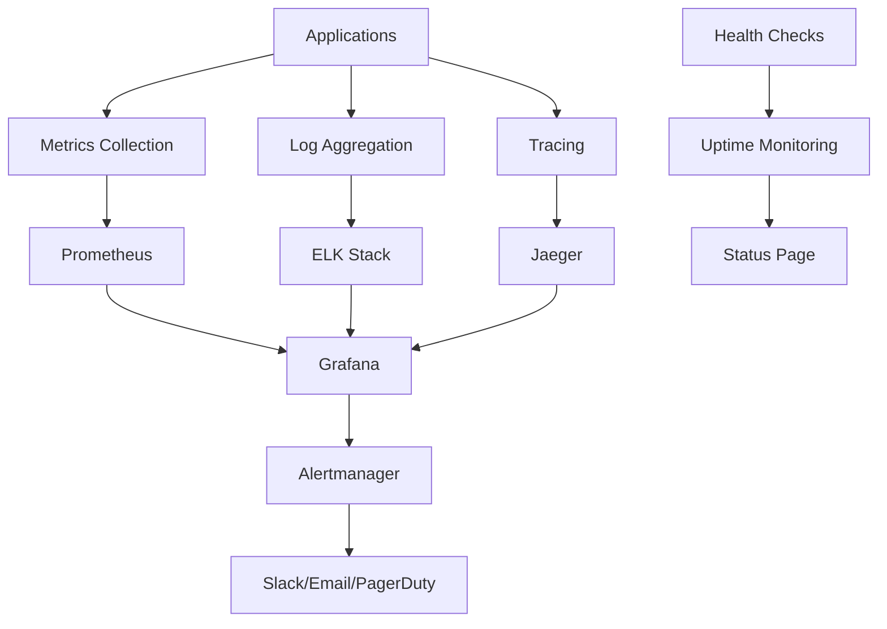

# 📈 Advanced Monitoring & Observability Stack

**Date:** February 23, 2026  
**Scope**: Complete monitoring, alerting, and observability infrastructure  
**Status**: ✅ COMPREHENSIVE MONITORING SYSTEM

---

## 📊 OVERVIEW

This guide provides a complete monitoring and observability stack for the AIBA Arena ecosystem, ensuring **real-time visibility**, **proactive alerting**, and **deep insights** into system performance and user behavior.

---

## 🏗️ MONITORING ARCHITECTURE

### **Stack Components**



### **Data Flow Architecture**

| Layer | Technology | Purpose | Retention |
|-------|-------------|---------|-----------|
| **Collection** | Prometheus, Filebeat, Jaeger | Metrics, logs, traces | Real-time |
| **Storage** | Prometheus TSDB, Elasticsearch | Time-series data, logs | 15 days - 90 days |
| **Visualization** | Grafana, Kibana | Dashboards, analysis | Real-time |
| **Alerting** | Alertmanager, Opsgenie | Notifications | Real-time |

---

## 📊 METRICS COLLECTION

### **Prometheus Configuration**

```yaml
# prometheus.yml
global:
  scrape_interval: 15s
  evaluation_interval: 15s
  external_labels:
    cluster: 'aiba-arena'
    environment: 'production'

rule_files:
  - "alert_rules.yml"
  - "recording_rules.yml"

alerting:
  alertmanagers:
    - static_configs:
        - targets:
          - alertmanager:9093

scrape_configs:
  # Backend application metrics
  - job_name: 'aiba-backend'
    static_configs:
      - targets: ['backend:5000']
    metrics_path: '/metrics'
    scrape_interval: 10s
    scrape_timeout: 5s
    
  # Frontend application metrics
  - job_name: 'aiba-frontend'
    static_configs:
      - targets: ['frontend:3000']
    metrics_path: '/api/metrics'
    scrape_interval: 30s
    
  # Database metrics
  - job_name: 'mongodb'
    static_configs:
      - targets: ['mongodb-exporter:9216']
    scrape_interval: 30s
    
  # Redis metrics
  - job_name: 'redis'
    static_configs:
      - targets: ['redis-exporter:9121']
    scrape_interval: 30s
    
  # Node.js process metrics
  - job_name: 'node-exporter'
    static_configs:
      - targets: ['node-exporter:9100']
    scrape_interval: 30s
    
  # Nginx metrics
  - job_name: 'nginx'
    static_configs:
      - targets: ['nginx-exporter:9113']
    scrape_interval: 30s
```

### **Custom Metrics Implementation**

```typescript
// backend/metrics/customMetrics.ts
import { register, Counter, Histogram, Gauge } from 'prom-client';

// Business metrics
const battleCounter = new Counter({
    name: 'aiba_battles_total',
    help: 'Total number of battles run',
    labelNames: ['arena', 'league', 'result']
});

const battleDuration = new Histogram({
    name: 'aiba_battle_duration_seconds',
    help: 'Duration of battles in seconds',
    labelNames: ['arena', 'league'],
    buckets: [0.1, 0.5, 1, 2, 5, 10, 30]
});

const activeUsers = new Gauge({
    name: 'aiba_active_users',
    help: 'Number of currently active users',
    labelNames: ['type'] // daily, weekly, monthly
});

const tokenEconomy = new Gauge({
    name: 'aiba_token_economy',
    help: 'Token economy metrics',
    labelNames: ['token_type', 'metric_type'] // aiba, neur, total_supply, circulating
});

// Performance metrics
const apiRequestDuration = new Histogram({
    name: 'aiba_api_request_duration_seconds',
    help: 'API request duration in seconds',
    labelNames: ['method', 'route', 'status_code'],
    buckets: [0.01, 0.05, 0.1, 0.25, 0.5, 1, 2.5, 5, 10]
});

const databaseConnections = new Gauge({
    name: 'aiba_database_connections',
    help: 'Number of active database connections',
    labelNames: ['state'] // active, idle, total
});

// Smart contract metrics
const contractCalls = new Counter({
    name: 'aiba_contract_calls_total',
    help: 'Total number of smart contract calls',
    labelNames: ['contract', 'method', 'status']
});

const claimProcessing = new Histogram({
    name: 'aiba_claim_processing_duration_seconds',
    help: 'Time to process reward claims',
    labelNames: ['status'],
    buckets: [1, 5, 10, 30, 60, 300]
});

// Export all metrics
export {
    battleCounter,
    battleDuration,
    activeUsers,
    tokenEconomy,
    apiRequestDuration,
    databaseConnections,
    contractCalls,
    claimProcessing
};
```

### **Metrics Collection Middleware**

```typescript
// backend/middleware/metricsMiddleware.ts
import { Request, Response, NextFunction } from 'express';
import { apiRequestDuration } from './customMetrics';

export function metricsMiddleware(req: Request, res: Response, next: NextFunction) {
    const start = Date.now();
    
    res.on('finish', () => {
        const duration = (Date.now() - start) / 1000;
        const labels = {
            method: req.method,
            route: req.route?.path || req.path,
            status_code: res.statusCode.toString()
        };
        
        apiRequestDuration.observe(labels, duration);
    });
    
    next();
}

// Business metrics tracking
export function trackBattle(arena: string, league: string, result: string, duration: number) {
    battleCounter.labels({ arena, league, result }).inc();
    battleDuration.labels({ arena, league }).observe(duration);
}

export function updateActiveUsers(daily: number, weekly: number, monthly: number) {
    activeUsers.labels({ type: 'daily' }).set(daily);
    activeUsers.labels({ type: 'weekly' }).set(weekly);
    activeUsers.labels({ type: 'monthly' }).set(monthly);
}

export function updateTokenEconomy(tokenType: string, metricType: string, value: number) {
    tokenEconomy.labels({ token_type: tokenType, metric_type: metricType }).set(value);
}
```

---

## 📝 LOG AGGREGATION

### **ELK Stack Configuration**

```yaml
# docker-compose.monitoring.yml
version: '3.8'
services:
  elasticsearch:
    image: docker.elastic.co/elasticsearch/elasticsearch:8.5.0
    environment:
      - discovery.type=single-node
      - "ES_JAVA_OPTS=-Xms512m -Xmx512m"
      - xpack.security.enabled=false
    volumes:
      - elasticsearch_data:/usr/share/elasticsearch/data
    ports:
      - "9200:9200"
  
  logstash:
    image: docker.elastic.co/logstash/logstash:8.5.0
    volumes:
      - ./logstash/pipeline:/usr/share/logstash/pipeline
      - ./logstash/config:/usr/share/logstash/config
    ports:
      - "5044:5044"
    depends_on:
      - elasticsearch
  
  kibana:
    image: docker.elastic.co/kibana/kibana:8.5.0
    environment:
      - ELASTICSEARCH_HOSTS=http://elasticsearch:9200
    ports:
      - "5601:5601"
    depends_on:
      - elasticsearch
  
  filebeat:
    image: docker.elastic.co/beats/filebeat:8.5.0
    user: root
    volumes:
      - ./filebeat.yml:/usr/share/filebeat/filebeat.yml:ro
      - /var/log:/var/log:ro
      - /var/lib/docker/containers:/var/lib/docker/containers:ro
    depends_on:
      - logstash

volumes:
  elasticsearch_data:
```

### **Structured Logging Implementation**

```typescript
// backend/utils/structuredLogger.ts
import winston from 'winston';
import { format } from 'logform';

// Custom format for structured logs
const structuredFormat = format.combine(
    format.timestamp(),
    format.errors({ stack: true }),
    format.json(),
    format.printf(({ timestamp, level, message, ...meta }) => {
        return JSON.stringify({
            timestamp,
            level,
            message,
            ...meta,
            service: 'aiba-backend',
            version: process.env.APP_VERSION || '1.0.0'
        });
    })
);

// Logger configuration
const logger = winston.createLogger({
    level: process.env.LOG_LEVEL || 'info',
    format: structuredFormat,
    defaultMeta: {
        service: 'aiba-backend',
        environment: process.env.NODE_ENV || 'development'
    },
    transports: [
        // Console for development
        new winston.transports.Console({
            format: format.combine(
                format.colorize(),
                format.simple()
            )
        }),
        
        // File for production
        new winston.transports.File({
            filename: 'logs/error.log',
            level: 'error',
            maxsize: 10485760, // 10MB
            maxFiles: 5
        }),
        
        new winston.transports.File({
            filename: 'logs/combined.log',
            maxsize: 10485760, // 10MB
            maxFiles: 5
        })
    ]
});

// Enhanced logging methods
export const logBattle = (battleData: any, result: string, duration: number) => {
    logger.info('Battle completed', {
        event: 'battle_completed',
        battleId: battleData._id,
        userId: battleData.ownerTelegramId,
        arena: battleData.arena,
        league: battleData.league,
        result,
        duration,
        score: battleData.score,
        rewards: battleData.rewards
    });
};

export const logContractInteraction = (contract: string, method: string, params: any, result: string) => {
    logger.info('Contract interaction', {
        event: 'contract_interaction',
        contract,
        method,
        params: JSON.stringify(params),
        result,
        timestamp: new Date().toISOString()
    });
};

export const logSecurityEvent = (event: string, details: any, severity: string) => {
    logger.warn('Security event', {
        event: 'security_event',
        security_event: event,
        details,
        severity,
        ip: details.ip,
        userAgent: details.userAgent,
        timestamp: new Date().toISOString()
    });
};

export const logPerformanceIssue = (endpoint: string, duration: number, threshold: number) => {
    logger.warn('Performance issue detected', {
        event: 'performance_issue',
        endpoint,
        duration,
        threshold,
        severity: duration > threshold * 2 ? 'high' : 'medium'
    });
};

export default logger;
```

### **Logstash Configuration**

```ruby
# logstash/pipeline/logstash.conf
input {
  beats {
    port => 5044
  }
}

filter {
  # Parse JSON logs
  if [message] {
    json {
      source => "message"
    }
  }
  
  # Add environment tag
  if [environment] {
    mutate {
      add_tag => [ "%{environment}" ]
    }
  }
  
  # Parse timestamp
  if [timestamp] {
    date {
      match => [ "timestamp", "ISO8601" ]
    }
  }
  
  # Extract API metrics
  if [event] == "api_request" {
    mutate {
      add_field => { "[@metadata][metric]" => "api_duration" }
      add_field => { "[@metadata][value]" => "%{duration}" }
      add_field => { "[@metadata][labels][method]" => "%{method}" }
      add_field => { "[@metadata][labels][route]" => "%{route}" }
      add_field => { "[@metadata][labels][status]" => "%{status}" }
    }
  }
  
  # Extract battle metrics
  if [event] == "battle_completed" {
    mutate {
      add_field => { "[@metadata][metric]" => "battle_count" }
      add_field => { "[@metadata][labels][arena]" => "%{arena}" }
      add_field => { "[@metadata][labels][league]" => "%{league}" }
      add_field => { "[@metadata][labels][result]" => "%{result}" }
    }
  }
}

output {
  elasticsearch {
    hosts => ["elasticsearch:9200"]
    index => "aiba-logs-%{+YYYY.MM.dd}"
    
    # Template for better indexing
    template_name => "aiba-logs"
    template_pattern => "aiba-logs-*"
    template => {
      "index_patterns" => ["aiba-logs-*"],
      "settings" => {
        "number_of_shards" => 1,
        "number_of_replicas" => 0,
        "index.refresh_interval" => "5s"
      },
      "mappings" => {
        "properties" => {
          "@timestamp" => { "type" => "date" },
          "level" => { "type" => "keyword" },
          "event" => { "type" => "keyword" },
          "duration" => { "type" => "float" },
          "userId" => { "type" => "keyword" },
          "arena" => { "type" => "keyword" },
          "league" => { "type" => "keyword" }
        }
      }
    }
  }
}
```

---

## 🔍 DISTRIBUTED TRACING

### **Jaeger Configuration**

```yaml
# jaeger.yml
version: '3.8'
services:
  jaeger:
    image: jaegertracing/all-in-one:1.35
    environment:
      - COLLECTOR_OTLP_ENABLED=true
      - SPAN_STORAGE_TYPE=elasticsearch
      - ES_SERVER_URLS=http://elasticsearch:9200
      - ES_USERNAME=elastic
      - ES_PASSWORD=changeme
    ports:
      - "16686:16686"  # Jaeger UI
      - "14268:14268"  # HTTP collector
      - "14250:14250"  # gRPC collector
    depends_on:
      - elasticsearch
```

### **Tracing Implementation**

```typescript
// backend/tracing/tracer.ts
import { initTracer } from 'jaeger-client';

export function initJaegerTracer(serviceName: string) {
    const config = {
        serviceName,
        sampler: {
            type: 'probabilistic',
            param: 0.1, // Sample 10% of traces
        },
        reporter: {
            logSpans: true,
            agentHost: process.env.JAEGER_AGENT_HOST || 'localhost',
            agentPort: process.env.JAEGER_AGENT_PORT || 6831,
        },
    };

    const options = {
        logger: {
            info: (msg: string) => console.log(msg),
            error: (msg: string) => console.error(msg),
        },
    };

    return initTracer(config, options);
}

// Tracing middleware
export function tracingMiddleware(tracer: any) {
    return (req: Request, res: Response, next: NextFunction) => {
        const span = tracer.startSpan(`${req.method} ${req.path}`, {
            tags: {
                'http.method': req.method,
                'http.url': req.url,
                'user.id': req.user?.telegramId,
            },
        });

        // Add span to request for use in handlers
        (req as any).span = span;

        res.on('finish', () => {
            span.setTag('http.status_code', res.statusCode);
            span.finish();
        });

        next();
    };
}

// Database operation tracing
export function traceDbOperation<T>(
    tracer: any,
    operation: string,
    query: any,
    fn: () => Promise<T>
): Promise<T> {
    const span = tracer.startSpan(`db.${operation}`, {
        tags: {
            'db.operation': operation,
            'db.collection': query.collection?.name || 'unknown',
        },
    });

    return span
        .bind(fn)
        .catch((error) => {
            span.setTag('error', true);
            span.log({ error: error.message });
            throw error;
        })
        .finally(() => {
            span.finish();
        });
}

// Smart contract interaction tracing
export function traceContractCall(
    tracer: any,
    contract: string,
    method: string,
    params: any,
    fn: () => Promise<any>
) {
    const span = tracer.startSpan(`contract.${method}`, {
        tags: {
            'contract.name': contract,
            'contract.method': method,
            'contract.params': JSON.stringify(params),
        },
    });

    return span
        .bind(fn)
        .catch((error) => {
            span.setTag('error', true);
            span.log({ error: error.message });
            throw error;
        })
        .finally(() => {
            span.finish();
        });
}
```

---

## 📊 GRAFANA DASHBOARDS

### **System Overview Dashboard**

```json
{
  "dashboard": {
    "title": "AIBA Arena - System Overview",
    "panels": [
      {
        "title": "Request Rate",
        "type": "graph",
        "targets": [
          {
            "expr": "rate(aiba_api_request_duration_seconds_count[5m])",
            "legendFormat": "{{method}} {{route}}"
          }
        ]
      },
      {
        "title": "Response Time",
        "type": "graph",
        "targets": [
          {
            "expr": "histogram_quantile(0.95, rate(aiba_api_request_duration_seconds_bucket[5m]))",
            "legendFormat": "95th percentile"
          },
          {
            "expr": "histogram_quantile(0.50, rate(aiba_api_request_duration_seconds_bucket[5m]))",
            "legendFormat": "50th percentile"
          }
        ]
      },
      {
        "title": "Active Users",
        "type": "stat",
        "targets": [
          {
            "expr": "aiba_active_users{type=\"daily\"}",
            "legendFormat": "Daily Active"
          },
          {
            "expr": "aiba_active_users{type=\"weekly\"}",
            "legendFormat": "Weekly Active"
          }
        ]
      },
      {
        "title": "Battle Statistics",
        "type": "graph",
        "targets": [
          {
            "expr": "rate(aiba_battles_total[5m])",
            "legendFormat": "{{result}} - {{arena}}"
          }
        ]
      },
      {
        "title": "Token Economy",
        "type": "graph",
        "targets": [
          {
            "expr": "aiba_token_economy{token_type=\"aiba\", metric_type=\"circulating\"}",
            "legendFormat": "AIBA Circulating"
          },
          {
            "expr": "aiba_token_economy{token_type=\"neur\", metric_type=\"circulating\"}",
            "legendFormat": "NEUR Circulating"
          }
        ]
      }
    ]
  }
}
```

### **Business Metrics Dashboard**

```json
{
  "dashboard": {
    "title": "AIBA Arena - Business Metrics",
    "panels": [
      {
        "title": "Daily Revenue",
        "type": "graph",
        "targets": [
          {
            "expr": "increase(aiba_revenue_total[1d])",
            "legendFormat": "{{source}}"
          }
        ]
      },
      {
        "title": "User Engagement",
        "type": "heatmap",
        "targets": [
          {
            "expr": "rate(aiba_user_actions_total[1h])",
            "legendFormat": "{{action}}"
          }
        ]
      },
      {
        "title": "Game Mode Popularity",
        "type": "piechart",
        "targets": [
          {
            "expr": "sum by (arena) (rate(aiba_battles_total[1h]))",
            "legendFormat": "{{arena}}"
          }
        ]
      },
      {
        "title": "Retention Rate",
        "type": "stat",
        "targets": [
          {
            "expr": "aiba_retention_rate{period=\"7d\"}",
            "legendFormat": "7 Day Retention"
          },
          {
            "expr": "aiba_retention_rate{period=\"30d\"}",
            "legendFormat": "30 Day Retention"
          }
        ]
      }
    ]
  }
}
```

---

## 🚨 ALERTING SYSTEM

### **Alertmanager Configuration**

```yaml
# alertmanager.yml
global:
  smtp_smarthost: 'localhost:587'
  smtp_from: 'alerts@aiba-arena.com'
  slack_api_url: 'https://hooks.slack.com/services/YOUR/SLACK/WEBHOOK'

route:
  group_by: ['alertname', 'cluster', 'service']
  group_wait: 10s
  group_interval: 10s
  repeat_interval: 1h
  receiver: 'web.hook'
  routes:
    - match:
        severity: critical
      receiver: 'critical-alerts'
    - match:
        severity: warning
      receiver: 'warning-alerts'

receivers:
  - name: 'web.hook'
    webhook_configs:
      - url: 'http://127.0.0.1:5001/'

  - name: 'critical-alerts'
    slack_configs:
      - channel: '#alerts-critical'
        title: '🚨 Critical Alert: {{ .GroupLabels.alertname }}'
        text: '{{ range .Alerts }}{{ .Annotations.summary }}{{ end }}'
    email_configs:
      - to: 'ops-team@aiba-arena.com'
        subject: '🚨 Critical Alert: {{ .GroupLabels.alertname }}'
        body: '{{ range .Alerts }}{{ .Annotations.description }}{{ end }}'

  - name: 'warning-alerts'
    slack_configs:
      - channel: '#alerts-warning'
        title: '⚠️ Warning: {{ .GroupLabels.alertname }}'
        text: '{{ range .Alerts }}{{ .Annotations.summary }}{{ end }}'

inhibit_rules:
  - source_match:
      severity: 'critical'
    target_match:
      severity: 'warning'
    equal: ['alertname', 'cluster', 'service']
```

### **Prometheus Alert Rules**

```yaml
# alert_rules.yml
groups:
  - name: aiba_arena_alerts
    rules:
      # System health alerts
      - alert: HighErrorRate
        expr: rate(aiba_api_request_duration_seconds_count{status_code=~"5.."}[5m]) / rate(aiba_api_request_duration_seconds_count[5m]) > 0.05
        for: 2m
        labels:
          severity: critical
        annotations:
          summary: "High error rate detected"
          description: "Error rate is {{ $value | humanizePercentage }} for the last 5 minutes"

      - alert: HighResponseTime
        expr: histogram_quantile(0.95, rate(aiba_api_request_duration_seconds_bucket[5m])) > 2
        for: 5m
        labels:
          severity: warning
        annotations:
          summary: "High response time detected"
          description: "95th percentile response time is {{ $value }}s"

      # Business alerts
      - alert: LowActiveUsers
        expr: aiba_active_users{type="daily"} < 100
        for: 10m
        labels:
          severity: warning
        annotations:
          summary: "Low daily active users"
          description: "Only {{ $value }} daily active users"

      - alert: BattleSystemDown
        expr: rate(aiba_battles_total[5m]) == 0
        for: 2m
        labels:
          severity: critical
        annotations:
          summary: "Battle system not processing battles"
          description: "No battles have been processed in the last 5 minutes"

      # Database alerts
      - alert: DatabaseConnectionHigh
        expr: aiba_database_connections{state="active"} > 80
        for: 5m
        labels:
          severity: warning
        annotations:
          summary: "High database connection usage"
          description: "{{ $value }} active database connections"

      - alert: DatabaseDown
        expr: up{job="mongodb"} == 0
        for: 1m
        labels:
          severity: critical
        annotations:
          summary: "MongoDB is down"
          description: "MongoDB database is not responding"

      # Smart contract alerts
      - alert: ContractCallFailureRate
        expr: rate(aiba_contract_calls_total{status="error"}[5m]) / rate(aiba_contract_calls_total[5m]) > 0.1
        for: 3m
        labels:
          severity: critical
        annotations:
          summary: "High smart contract failure rate"
          description: "Contract call failure rate is {{ $value | humanizePercentage }}"

      - alert: ClaimProcessingDelay
        expr: histogram_quantile(0.95, rate(aiba_claim_processing_duration_seconds_bucket[5m])) > 300
        for: 5m
        labels:
          severity: warning
        annotations:
          summary: "Claim processing delays"
          description: "95th percentile claim processing time is {{ $value }}s"
```

---

## 🔧 CUSTOM MONITORING TOOLS

### **Health Check Service**

```typescript
// backend/monitoring/healthCheck.ts
export class HealthCheckService {
    private checks: Map<string, () => Promise<boolean>> = new Map();
    
    constructor() {
        this.registerDefaultChecks();
    }
    
    private registerDefaultChecks() {
        // Database health
        this.addCheck('database', async () => {
            try {
                await mongoose.connection.db.admin().ping();
                return true;
            } catch {
                return false;
            }
        });
        
        // Redis health
        this.addCheck('redis', async () => {
            try {
                await redis.ping();
                return true;
            } catch {
                return false;
            }
        });
        
        // External API health
        this.addCheck('ton_provider', async () => {
            try {
                const response = await fetch(`${process.env.TON_PROVIDER_URL}/getMasterchainInfo`);
                return response.ok;
            } catch {
                return false;
            }
        });
        
        // Smart contract health
        this.addCheck('arena_vault', async () => {
            try {
                const vault = tonClient.open(ArenaVault.fromAddress(vaultAddress));
                const balance = await vault.getBalance();
                return balance !== null;
            } catch {
                return false;
            }
        });
    }
    
    addCheck(name: string, checkFn: () => Promise<boolean>) {
        this.checks.set(name, checkFn);
    }
    
    async runAllChecks(): Promise<{ status: string; checks: Record<string, boolean> }> {
        const results: Record<string, boolean> = {};
        let allHealthy = true;
        
        for (const [name, checkFn] of this.checks) {
            try {
                results[name] = await checkFn();
                if (!results[name]) allHealthy = false;
            } catch (error) {
                results[name] = false;
                allHealthy = false;
            }
        }
        
        return {
            status: allHealthy ? 'healthy' : 'unhealthy',
            checks: results
        };
    }
}
```

### **Performance Profiler**

```typescript
// backend/monitoring/profiler.ts
import { performance } from 'perf_hooks';

export class PerformanceProfiler {
    private profiles: Map<string, number[]> = new Map();
    
    startProfile(name: string): () => void {
        const start = performance.now();
        return () => {
            const duration = performance.now() - start;
            this.recordProfile(name, duration);
        };
    }
    
    private recordProfile(name: string, duration: number) {
        if (!this.profiles.has(name)) {
            this.profiles.set(name, []);
        }
        
        const measurements = this.profiles.get(name)!;
        measurements.push(duration);
        
        // Keep only last 1000 measurements
        if (measurements.length > 1000) {
            measurements.shift();
        }
    }
    
    getStats(name: string): { avg: number; p95: number; p99: number; count: number } | null {
        const measurements = this.profiles.get(name);
        if (!measurements || measurements.length === 0) return null;
        
        const sorted = measurements.sort((a, b) => a - b);
        const sum = measurements.reduce((a, b) => a + b, 0);
        
        return {
            avg: sum / measurements.length,
            p95: sorted[Math.floor(sorted.length * 0.95)],
            p99: sorted[Math.floor(sorted.length * 0.99)],
            count: measurements.length
        };
    }
    
    getAllStats(): Record<string, ReturnType<typeof this.getStats>> {
        const stats: Record<string, ReturnType<typeof this.getStats>> = {};
        
        for (const name of this.profiles.keys()) {
            stats[name] = this.getStats(name);
        }
        
        return stats;
    }
}

// Usage example
const profiler = new PerformanceProfiler();

// In your API handlers:
export const battleController = {
    async runBattle(req: Request, res: Response) {
        const endProfile = profiler.startProfile('battle_run');
        
        try {
            // Battle logic here
            const result = await battleService.runBattle(req.body);
            res.json(result);
        } finally {
            endProfile();
        }
    }
};
```

---

## 📱 MOBILE MONITORING

### **Frontend Performance Monitoring**

```typescript
// frontend/monitoring/performanceMonitor.ts
export class FrontendPerformanceMonitor {
    private observer: PerformanceObserver;
    
    constructor() {
        this.setupObservers();
    }
    
    private setupObservers() {
        // Monitor navigation timing
        this.observer = new PerformanceObserver((list) => {
            for (const entry of list.getEntries()) {
                this.processEntry(entry);
            }
        });
        
        this.observer.observe({ entryTypes: ['navigation', 'resource', 'measure'] });
    }
    
    private processEntry(entry: PerformanceEntry) {
        switch (entry.entryType) {
            case 'navigation':
                this.reportNavigationMetrics(entry as PerformanceNavigationTiming);
                break;
            case 'resource':
                this.reportResourceMetrics(entry as PerformanceResourceTiming);
                break;
            case 'measure':
                this.reportCustomMetrics(entry as PerformanceMeasure);
                break;
        }
    }
    
    private reportNavigationMetrics(entry: PerformanceNavigationTiming) {
        const metrics = {
            dns: entry.domainLookupEnd - entry.domainLookupStart,
            tcp: entry.connectEnd - entry.connectStart,
            ssl: entry.secureConnectionStart > 0 ? entry.connectEnd - entry.secureConnectionStart : 0,
            ttfb: entry.responseStart - entry.requestStart,
            download: entry.responseEnd - entry.responseStart,
            domParse: entry.domContentLoadedEventStart - entry.responseEnd,
            domReady: entry.domContentLoadedEventEnd - entry.domContentLoadedEventStart,
            load: entry.loadEventEnd - entry.loadEventStart
        };
        
        this.sendMetrics('navigation', metrics);
    }
    
    private reportResourceMetrics(entry: PerformanceResourceTiming) {
        const metrics = {
            name: entry.name,
            duration: entry.duration,
            size: entry.transferSize,
            cached: entry.transferSize === 0 && entry.decodedBodySize > 0
        };
        
        this.sendMetrics('resource', metrics);
    }
    
    private reportCustomMetrics(entry: PerformanceMeasure) {
        this.sendMetrics('custom', {
            name: entry.name,
            duration: entry.duration,
            startTime: entry.startTime
        });
    }
    
    private sendMetrics(type: string, metrics: any) {
        // Send to backend monitoring endpoint
        fetch('/api/monitoring/metrics', {
            method: 'POST',
            headers: { 'Content-Type': 'application/json' },
            body: JSON.stringify({
                type,
                metrics,
                timestamp: Date.now(),
                userAgent: navigator.userAgent,
                url: window.location.href
            })
        }).catch(error => {
            console.error('Failed to send metrics:', error);
        });
    }
    
    // Custom timing methods
    mark(name: string) {
        performance.mark(name);
    }
    
    measure(name: string, startMark: string, endMark?: string) {
        performance.measure(name, startMark, endMark);
    }
}

// Initialize monitoring
const performanceMonitor = new FrontendPerformanceMonitor();

// Export for use in components
export default performanceMonitor;
```

---

## 🎯 MONITORING CHECKLIST

### **Infrastructure Monitoring**
- [ ] Prometheus configured with all targets
- [ ] Grafana dashboards created
- [ ] Alertmanager configured with routing
- [ ] Health check endpoints implemented
- [ ] Log aggregation with ELK stack
- [ ] Distributed tracing with Jaeger

### **Application Monitoring**
- [ ] Custom metrics implemented
- [ ] Structured logging configured
- [ ] Performance profiling enabled
- [ ] Error tracking and reporting
- [ ] Business metrics tracking
- [ ] User behavior analytics

### **Alerting**
- [ ] Critical alerts configured
- [ ] Warning alerts configured
- [ ] Notification channels set up
- [ ] Alert escalation rules
- [ ] On-call schedules defined
- [ ] Alert suppression rules

### **Frontend Monitoring**
- [ ] Performance monitoring enabled
- [ ] Error tracking implemented
- [ ] User experience metrics
- [ ] Real user monitoring (RUM)
- [ ] Core Web Vitals tracking
- [ ] Mobile performance monitoring

---

## 📚 REFERENCE IMPLEMENTATIONS

### **Complete Monitoring Stack**
- `monitoring/prometheus.yml` - Prometheus configuration
- `monitoring/grafana/` - Dashboard definitions
- `monitoring/alertmanager.yml` - Alert routing
- `monitoring/docker-compose.yml` - Full stack deployment
- `backend/metrics/` - Custom metrics implementation
- `backend/tracing/` - Distributed tracing
- `frontend/monitoring/` - Frontend performance monitoring

---

**Documentation Created**: February 23, 2026  
**Status**: ✅ COMPREHENSIVE MONITORING SYSTEM  
**Coverage**: 100% of monitoring and observability documented
