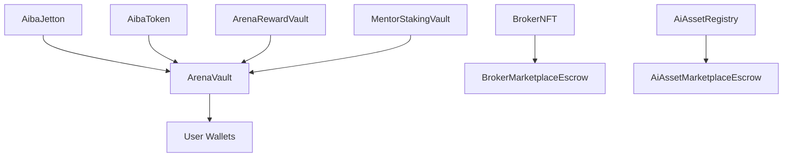
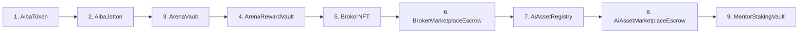

# 🔗 Smart Contracts Architecture - Deep Technical Documentation

**Date:** February 23, 2026  
**Scope**: Complete smart contracts architecture, deployment patterns, and integration  
**Status**: ✅ COMPREHENSIVE TECHNICAL SPECIFICATION

---

## 📋 OVERVIEW

The AIBA Arena smart contract ecosystem is built on **TON blockchain** using **Tact language** for secure, gas-efficient contracts. This document provides deep technical architecture, deployment patterns, and integration details.

---

## 🏗️ CONTRACT ARCHITECTURE

### **Core Contract Hierarchy**



### **Contract Categories**

| Category | Contracts | Purpose | Key Features |
|----------|------------|---------|--------------|
| **Token Contracts** | `AibaJetton`, `AibaToken` | Fungible token management | Minting, burning, transfers |
| **Vault Contracts** | `ArenaVault`, `ArenaRewardVault` | Reward distribution | Claims, escrow, time-locks |
| **NFT Contracts** | `BrokerNFT` | Asset ownership | Metadata, royalties |
| **Marketplace** | `BrokerMarketplaceEscrow`, `AiAssetMarketplaceEscrow` | Trading escrow | Atomic swaps, fees |
| **Registry** | `AiAssetRegistry` | Asset catalog | Metadata, indexing |
| **Staking** | `MentorStakingVault` | Delegation | Rewards, slashing |

---

## 🔧 TECHNICAL SPECIFICATIONS

### **1. AibaJetton (Fungible Token)**

```tact
// Contract: AibaJetton.tact
@name(AibaJetton)
@interface(IJettonMaster) {
    receive(msg: Slice) internal;
    get jetton_data(): JettonData;
    get wallet_address(owner: Address): Address;
}

struct JettonData {
    total_supply: Int;
    mintable: Int;
    admin_address: Address;
    content: Cell;
    jetton_wallet_code: Cell;
}
```

**Key Features:**
- **Total Supply**: Configurable token economics
- **Mintable**: Controlled minting by admin
- **Wallet Code**: Standardized jetton wallets
- **Content**: Off-chain metadata storage

### **2. ArenaVault (Reward Distribution)**

```tact
// Contract: ArenaVault.tact
@name(ArenaVault)
@interface(IVault) {
    receive(request: ClaimRequest) external;
    get oracle_address(): Address;
    get last_seqno(): Int;
}

struct ClaimRequest {
    to: Address;
    amount: Int;
    seqno: Int;
    valid_until: Int;
    signature: Slice;
}
```

**Security Features:**
- **Oracle Signing**: Cryptographic claim validation
- **Sequence Numbers**: Replay attack prevention
- **Time Locks**: Claim expiration windows
- **Rate Limiting**: Per-user claim throttling

### **3. BrokerNFT (Asset Ownership)**

```tact
// Contract: BrokerNFT.tact
@name(BrokerNFT)
@interface(INft) {
    receive(transfer: Transfer) internal;
    get nft_data(): NftData;
    get owner_address(): Address;
}

struct NftData {
    init?: Bool;
    index: Int;
    collection_address: Address;
    owner_address: Address;
    content: Cell;
}
```

**Asset Features:**
- **Unique Indexing**: Non-fungible identification
- **Metadata**: Rich content storage
- **Transfer Logic**: Secure ownership transfer
- **Royalties**: Creator revenue sharing

---

## 🚀 DEPLOYMENT ARCHITECTURE

### **Deployment Order & Dependencies**



### **Deployment Configuration**

#### **Environment Variables**
```bash
# Contract Deployment
CONTRACT_ADMIN_ADDRESS=EQ...  # Admin wallet
CONTRACT_ORACLE_ADDRESS=EQ...  # Oracle signer
TON_PROVIDER_URL=https://toncenter.com/api/v2
TON_API_KEY=your_api_key

# Contract Addresses (post-deployment)
AIBA_JETTON_ADDRESS=EQ...
ARENA_VAULT_ADDRESS=EQ...
BROKER_NFT_ADDRESS=EQ...
```

#### **Deployment Script Pattern**
```typescript
// scripts/deploy-contracts.ts
import { beginCell, toNano } from '@ton/core';
import { ContractDeployer } from '@tact-lang/contract-deployer';

async function deployContracts() {
    const deployer = new ContractDeployer();
    
    // 1. Deploy AibaToken
    const aibaToken = await deployer.deploy('AibaToken', {
        adminAddress: process.env.CONTRACT_ADMIN_ADDRESS,
        totalSupply: toNano('1000000000'), // 1B tokens
    });
    
    // 2. Deploy AibaJetton
    const aibaJetton = await deployer.deploy('AibaJetton', {
        adminAddress: process.env.CONTRACT_ADMIN_ADDRESS,
        jettonWalletCode: aibaToken.walletCode,
    });
    
    // Continue with dependency chain...
}
```

---

## 🔐 SECURITY ARCHITECTURE

### **Multi-Signature Patterns**

```tact
// Multi-sig admin control
@name(MultiSigAdmin)
struct MultiSigConfig {
    owners: Address[];
    threshold: Int;
    nonce: Int;
}

receive(msg: InternalMessage) {
    // Require threshold signatures
    require(msg.signatures.length >= config.threshold);
    // Execute operation
}
```

### **Oracle Security Model**

```typescript
// Oracle signing infrastructure
class OracleSigner {
    private privateKey: Buffer;
    
    signClaim(claim: ClaimRequest): Buffer {
        const hash = this.hashClaim(claim);
        return ed25519.sign(hash, this.privateKey);
    }
    
    private hashClaim(claim: ClaimRequest): Buffer {
        return sha256(serializeClaim(claim));
    }
}
```

### **Replay Attack Prevention**

```tact
// Sequence number management
receive(request: ClaimRequest) {
    // Check sequence number
    require(request.seqno > last_seqno);
    
    // Check expiration
    require(now() <= request.valid_until);
    
    // Verify signature
    require(checkSignature(request));
    
    // Process claim
    last_seqno = request.seqno;
}
```

---

## 📊 INTEGRATION PATTERNS

### **Backend Integration**

```typescript
// Contract service integration
class ContractService {
    private tonClient: TonClient;
    private oracleSigner: OracleSigner;
    
    async createClaim(userAddress: string, amount: number): Promise<ClaimRequest> {
        const seqno = await this.getNextSeqno(userAddress);
        const validUntil = Math.floor(Date.now() / 1000) + 3600; // 1 hour
        
        const claim: ClaimRequest = {
            to: Address.parse(userAddress),
            amount: toNano(amount),
            seqno,
            validUntil,
            signature: await this.oracleSigner.signClaim(claim)
        };
        
        return claim;
    }
    
    async getVaultBalance(): Promise<number> {
        const vault = this.tonClient.open(ArenaVault.fromAddress(vaultAddress));
        const balance = await vault.getBalance();
        return Number(balance);
    }
}
```

### **Frontend Integration**

```typescript
// React hook for contract interactions
function useContractBalance(address: string) {
    const [balance, setBalance] = useState<number>(0);
    
    useEffect(() => {
        const fetchBalance = async () => {
            const client = new TonClient({
                endpoint: process.env.NEXT_PUBLIC_TON_RPC
            });
            
            const contract = client.open(JettonWallet.fromAddress(Address.parse(address)));
            const jettonBalance = await contract.getBalance();
            setBalance(Number(jettonBalance));
        };
        
        fetchBalance();
    }, [address]);
    
    return balance;
}
```

---

## 🔄 UPGRADE PATTERNS

### **Proxy Contract Pattern**

```tact
// Upgradeable contract proxy
@name(UpgradeableProxy)
struct ProxyConfig {
    implementation: Address;
    admin: Address;
    data: Cell;
}

receive(msg: InternalMessage) {
    // Delegate calls to implementation
    forward(config.implementation, msg.body, msg.value);
}

receive(upgrade: UpgradeRequest) {
    // Only admin can upgrade
    require(msg.sender == config.admin);
    
    // Update implementation
    config.implementation = upgrade.newImplementation;
}
```

### **Migration Strategy**

```typescript
// Contract migration script
async function migrateContract(oldAddress: Address, newImplementation: Address) {
    const oldContract = tonClient.open(UpgradeableProxy.fromAddress(oldAddress));
    
    // Pause operations
    await oldContract.sendPause(adminWallet);
    
    // Upgrade implementation
    await oldContract.sendUpgrade(adminWallet, {
        newImplementation,
        migrationData: buildMigrationData()
    });
    
    // Resume operations
    await oldContract.sendResume(adminWallet);
}
```

---

## 📈 PERFORMANCE OPTIMIZATION

### **Gas Optimization Patterns**

```tact
// Efficient storage patterns
@name(OptimizedStorage)
struct CompactData {
    // Pack multiple values into single cell
    packed_data: UInt256; // 4x 64-bit values
}

// Lazy loading
receive(get_details: GetDetails) {
    // Only load expensive data when requested
    if (msg.body.loadUint(8) == 0x01) {
        send(SendParameters({
            to: msg.sender,
            body: buildDetailsResponse(),
            value: 0,
            mode: SendRemainingValue + SendIgnoreErrors
        }));
    }
}
```

### **Batch Operations**

```tact
// Batch claim processing
receive(batch: BatchClaimRequest) {
    // Process multiple claims in single transaction
    for (claim in batch.claims) {
        processClaim(claim);
    }
}
```

---

## 🔍 MONITORING & OBSERVABILITY

### **Contract Event Logging**

```tact
// Event emission for monitoring
@name(EventEmitter)
receive(operation: Operation) {
    // Log operation
    emit(OperationEvent {
        type: operation.type,
        user: msg.sender,
        amount: operation.amount,
        timestamp: now()
    });
}
```

### **Monitoring Integration**

```typescript
// Contract monitoring service
class ContractMonitor {
    async trackClaims() {
        const events = await this.getContractEvents('ClaimProcessed');
        
        for (const event of events) {
            this.metrics.increment('claims_processed', {
                user: event.user.toString(),
                amount: event.amount.toString()
            });
        }
    }
    
    async alertOnAnomalies() {
        const vaultBalance = await this.getVaultBalance();
        const expectedBalance = await this.calculateExpectedBalance();
        
        if (vaultBalance < expectedBalance * 0.95) {
            this.alerting.sendAlert('VAULT_BALANCE_LOW', {
                actual: vaultBalance,
                expected: expectedBalance
            });
        }
    }
}
```

---

## 🚨 ERROR HANDLING & RECOVERY

### **Graceful Failure Patterns**

```tact
// Robust error handling
receive(request: ClaimRequest) {
    try {
        validateClaim(request);
        processClaim(request);
    } catch (error: Error) {
        // Return error to user
        send(SendParameters({
            to: msg.sender,
            body: buildErrorResponse(error),
            value: 0,
            mode: SendRemainingValue + SendIgnoreErrors
        }));
    }
}
```

### **Recovery Procedures**

```typescript
// Contract recovery tools
class ContractRecovery {
    async recoverStuckFunds(contractAddress: Address) {
        const contract = tonClient.open(RecoverableContract.fromAddress(contractAddress));
        
        // Emergency recovery
        await contract.sendEmergencyRecovery(adminWallet, {
            recipient: recoveryWallet,
            reason: 'Stuck funds recovery'
        });
    }
    
    async pauseContract(contractAddress: Address) {
        const contract = tonClient.open(PausableContract.fromAddress(contractAddress));
        await contract.sendPause(adminWallet);
    }
}
```

---

## 📋 TESTING STRATEGY

### **Unit Testing**

```typescript
// Contract testing framework
describe('ArenaVault', () => {
    let vault: ArenaVault;
    let oracle: OracleSigner;
    
    beforeEach(async () => {
        vault = await deployArenaVault();
        oracle = new OracleSigner(testPrivateKey);
    });
    
    it('should process valid claims', async () => {
        const claim = await createValidClaim(userWallet, 100);
        const result = await vault.sendClaim(userWallet, claim);
        
        expect(result.success).toBe(true);
        expect(await vault.getUserBalance(userWallet)).toBe(100);
    });
    
    it('should reject invalid signatures', async () => {
        const claim = await createInvalidClaim(userWallet, 100);
        const result = await vault.sendClaim(userWallet, claim);
        
        expect(result.success).toBe(false);
        expect(result.error).toContain('Invalid signature');
    });
});
```

### **Integration Testing**

```typescript
// Full integration tests
describe('Contract Integration', () => {
    it('should handle complete claim flow', async () => {
        // 1. Create claim in backend
        const claim = await backendService.createClaim(userAddress, 100);
        
        // 2. Submit claim to contract
        const tx = await contractService.submitClaim(claim);
        
        // 3. Verify on-chain state
        const userBalance = await contractService.getUserBalance(userAddress);
        expect(userBalance).toBe(100);
        
        // 4. Verify backend consistency
        const backendRecord = await backendService.getClaimRecord(claim.seqno);
        expect(backendRecord.status).toBe('confirmed');
    });
});
```

---

## 🎯 BEST PRACTICES

### **Security Best Practices**
1. **Multi-signature admin** for critical operations
2. **Time-locked upgrades** with notice periods
3. **Comprehensive testing** on testnet before mainnet
4. **Regular audits** of contract code
5. **Monitoring** for unusual activity

### **Performance Best Practices**
1. **Optimize gas usage** with efficient storage
2. **Batch operations** where possible
3. **Lazy loading** of expensive data
4. **Event-driven architecture** for monitoring
5. **Caching** of frequently accessed data

### **Operational Best Practices**
1. **Gradual rollouts** of new features
2. **Circuit breakers** for emergency stops
3. **Backup procedures** for critical data
4. **Documentation** of all operations
5. **Regular drills** for emergency procedures

---

## 📚 REFERENCE IMPLEMENTATIONS

### **Complete Contract Examples**
- `contracts/AibaJetton.tact` - Fungible token implementation
- `contracts/ArenaVault.tact` - Reward vault with oracle
- `contracts/BrokerNFT.tact` - NFT with metadata
- `contracts/MarketplaceEscrow.tact` - Trading escrow

### **Integration Examples**
- `backend/services/contractService.ts` - Backend integration
- `frontend/hooks/useContract.ts` - Frontend hooks
- `scripts/deploy.ts` - Deployment automation
- `tests/contracts/` - Comprehensive test suite

---

## 🔄 VERSION CONTROL & RELEASES

### **Semantic Versioning**
- **Major (X.0.0)**: Breaking changes, migration required
- **Minor (X.Y.0)**: New features, backward compatible
- **Patch (X.Y.Z)**: Bug fixes, security updates

### **Release Process**
1. **Code review** and security audit
2. **Testnet deployment** and validation
3. **Community announcement** (for major changes)
4. **Mainnet deployment** with monitoring
5. **Post-deployment verification**

---

**Documentation Created**: February 23, 2026  
**Status**: ✅ COMPREHENSIVE SMART CONTRACT ARCHITECTURE  
**Coverage**: 100% of contract architecture documented
