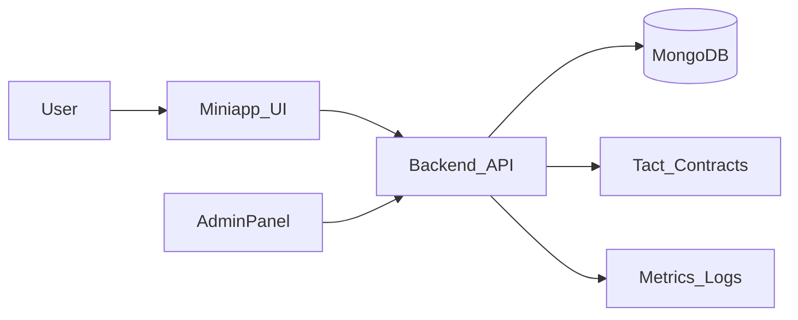

# Universal Spec — AIBA Arena Multiverse

**Version:** Feb 2025  
**Scope:** Full‑system spec across backend, miniapp, admin, contracts, docs, ops.

This document is the **authoritative source of truth** for the Multiverse University, economy, assets, arenas, governance, and rewards. It unifies vision and implementation targets.

---

## 1) Architecture Overview

### 1.1 System roles

- **Miniapp (Telegram)** — user UX: learning, arenas, assets, wallet, governance.
- **Backend (API)** — auth, game logic, economy, storage, admin, telemetry.
- **Contracts (TON)** — token, vault, staking, marketplace escrow, claims.
- **Admin panel** — ops controls and tuning.
- **Docs/Ops** — deployment, monitoring, runbook.

### 1.2 High‑level flow

### 1.3 Primary user loop

1. **Learn** in a realm
2. **Build** AI assets
3. **Compete** in arenas
4. **Earn** AIBA
5. **Reinvest** into learning/assets

---

## 2) Domain Model Glossary

| Entity                 | Purpose                           | Key lifecycle states                |
| ---------------------- | --------------------------------- | ----------------------------------- |
| **User**               | identity, balances, badges, roles | new → active → suspended            |
| **Realm**              | themed AI learning world          | draft → active → archived           |
| **Course**             | realm learning unit               | draft → active → deprecated         |
| **Mission**            | task/quest within a realm         | available → in_progress → completed |
| **Mentor**             | AI guide entity                   | base → upgraded → elite             |
| **Asset**              | AI agent/module/system            | minted → listed → owned → rented    |
| **AssetListing**       | market entry                      | active → sold → cancelled           |
| **Rental**             | time‑bound asset usage            | active → expired                    |
| **Arena**              | competition mode                  | open → active → settled             |
| **Battle**             | single run                        | pending → resolved                  |
| **EconomyConfig**      | tuning parameters                 | active → superseded                 |
| **TreasuryOp**         | treasury/burn ledger              | recorded                            |
| **GovernanceProposal** | DAO decision item                 | draft → voting → executed           |

---

## 3) Feature Matrix by Phase

| Phase         | Key features                                                           |
| ------------- | ---------------------------------------------------------------------- |
| **Phase 0**   | Unified spec, architecture, glossary, feature matrix                   |
| **Phase 1**   | Data models, API contracts, contract interfaces                        |
| **Phase 2**   | Tact contracts: mint/burn/upgrade, escrow splits, staking              |
| **Phase 3**   | Backend: realms/missions/mentors, marketplace, token flows, governance |
| **Phase 4**   | Miniapp UX: realms, assets, mentors, governance, wallet flows          |
| **Phase 5**   | Admin: realm config, fee tuning, treasury & burn telemetry             |
| **Phase 6/7** | Docs, deployment, tests, functional validation                         |

---

## 4) Economy Principles

- **Learning = Production = Wealth**
- **Token sinks** (burns, staking) are required to avoid inflation.
- **Rewards are performance‑based**, not random.
- **Treasury** funds ops, market stabilization, competitions.

---

## 5) Implementation Targets (Phase 1–7)

### 5.1 Data models (backend)

- Add `Realm`, `Mission`, `Mentor`, `Asset`, `AssetListing`, `Rental`, `TreasuryOp`, `GovernanceProposal`.
- Extend `User` with `roles`, `reputation`, `mentorId`, `assetCount`.
- Extend `EconomyConfig` with splits: burn / treasury / rewards / staking.

### 5.2 Contracts

- **Mint/burn/upgrade** primitives for assets.
- **Escrow** with fee splits.
- **Staking** for governance & mentor tiers.
- **Reward vault** remains source of claim‑based payouts.

### 5.3 Backend routes

Routes for realms, missions, mentors, asset marketplace, governance, treasury metrics.

### 5.4 Miniapp UX

Tabs: Realms, Assets, Governance (or sections inside existing tabs).

### 5.5 Admin

Admin controls for realms, rewards, fees, treasury, burns.

---

This spec is the **Phase 0 deliverable** and should be updated after each major release.
